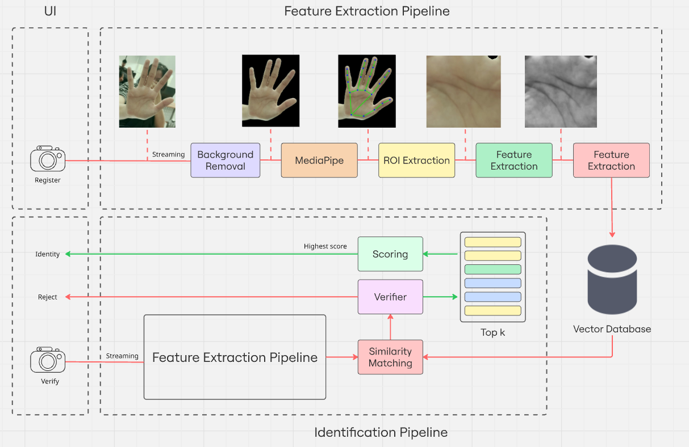
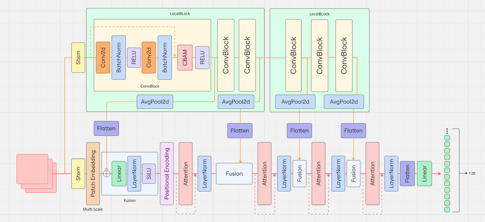

# Real-Time Palm-Print Identification System

https://github.com/user-attachments/assets/a50e894c-6ea9-4e71-bc9a-5ac9169726af

Experience real-time palm print identification with our advanced system.

## Table of Contents

- [System Architecture](#system-architecture)
- [Model Structure](#model-structure)
- [Prerequisites](#prerequisites)
- [Installation](#installation)
- [Running the Demos](#running-the-demos)
  - [Palm Print Identification Demo](#palm-print-identification-demo)
  - [Background Removal Demo](#background-removal-demo)
- [Training and Testing](#training-and-testing)
- [Model Conversion](#model-conversion)

## System Architecture

Our palm print identification system employs a sophisticated architecture combining several key components:



We used model inference server (Triton) Handles all model and vector database (Qdrant)

## Model Structure

The system utilizes Triton Inference Server to serve two main models:

### 1. Feature Extraction Model
- Responsible for extracting unique palm print features
- Used for palm print matching and identification
- Deployed on Triton Inference Server
- Located in `model_repository/feature_extraction`



### 2. Depth Estimation Model
- Implements Depth Anything V2 for depth estimation
- Enhances palm print analysis with depth information
- Used for background removal in palm print images
- Deployed on Triton Inference Server
- Located in `model_repository/depth_anything_v2`
- Based on [Depth Anything V2](https://github.com/DepthAnything/Depth-Anything-V2)

Both models are optimized and served through NVIDIA Triton Inference Server, providing:
- Efficient model management and versioning
- Optimized inference performance
- Concurrent model execution
- Dynamic batching support
- Model monitoring and metrics

## Prerequisites

Before starting, ensure you have:
- **Docker** installed on your system
- Access to download model checkpoints (links provided below)

## Installation

### 1. Clone Repository
```bash
git clone https://github.com/VKev/Palm-Print-Identification-System-V2.git
cd Palm-Print-Identification-System-V2
```

### 2. Download Model Checkpoints

#### Feature Extraction Model
- Download from: [Feature Extraction Model](https://drive.google.com/file/d/1h28z9Es4IRkCnJTiPyqy41-qHPHrLH8Z/view?usp=sharing)

#### Depth Estimation Model
- Download from: [Depth Estimation Model](https://drive.google.com/file/d/1ThNm0Wugh3Oa3FkgGuQ9iaUIE7OVGcvj/view?usp=sharing)

### 3. Setup Model Repository
Place the downloaded models in the following structure:
```
model_repository/
├── feature_extraction/
│   └── 1/
│       └── model.pt
└── depth_anything_v2/
    └── 1/
        └── model.pt
```

**Note**: Create the directories manually if they don't exist.

### 4. Install Dependencies
Install all required packages using a single command:
```bash
pip install -r requirements.txt
```
**Tip**: Using a virtual environment is recommended.

## Running the Demos

### Palm Print Identification Demo

1. Start Docker services:
```bash
docker-compose up -d
```

2. Launch the main application:
```bash
python app.py
```

Access the palm print identification demo at: `http://localhost:7000`

### Background Removal Demo

1. Navigate to depth estimation directory:
```bash
cd depth_estimation
```

2. Run the background removal application:
```bash
python app.py
```

Access the background removal demo at: `http://localhost:8000`

## Training and Testing

### Dataset Acquisition For Training

To train the model, you'll need to request access to these datasets:
- [IITD Palmprint Database](https://www4.comp.polyu.edu.hk/~csajaykr/IITD/Database_Palm.htm)
- [PolyU 3D Palmprint Database](https://www4.comp.polyu.edu.hk/~csajaykr/myhome/database_request/3dhand/Hand3D.htm)

After approval, email huynhkhang7452@gmail.com with proof of acceptance to receive the formatted training dataset.

### Test Dataset
The test dataset is readily available and can be downloaded from:
[Test Dataset](https://drive.google.com/file/d/1kFcFewKQLcPXVdtInzIxcj2OSg2fZ_Dn/view?usp=drive_link)

### Training Options

#### Local Environment

1. Setup Feature Extraction:
```bash
cd feature_extraction
pip install -r requirements.txt
```

2. Train the model:
```bash
python train.py --train_path /path/to/dataset/TrainAndTest/train --test_path /path/to/dataset/TrainAndTest/test
```

3. Resume training (optional):
```bash
python train.py --train_path /path/to/dataset/TrainAndTest/train --test_path /path/to/dataset/TrainAndTest/test --checkpoint_path checkpoints/your_checkpoint.pth
```

4. Test the model:
```bash
python test.py --validate_path /path/to/dataset/TrainAndTest/test --checkpoint_path checkpoints/your_checkpoint.pth
```

#### Using Docker

1. Pull the Docker image:
```bash
docker pull vkev25811/cuda12.4-cudnn9-devel:latest
```

2. Run container:
```bash
docker run -it --shm-size=8g --gpus all --name palm_print_container \
  -p 8081:8081 \
  -v /path/to/Palm-Print-Identification-System-V2:/app \
  -v /path/to/dataset:/dataset \
  -w /app vkev25811/cuda12.4-cudnn9-devel:latest
```

3. Follow the same training commands as in Local Environment.

## Model Conversion

### Converting Feature Extraction Model (.pth → .pt)

1. Update checkpoint path in `torchscript.py`

2. Convert model:
```bash
python torchscript.py
```

### Restart Services

Clean up existing services:
```bash
docker-compose down
```

Start fresh:
```bash
docker-compose up -d
```
